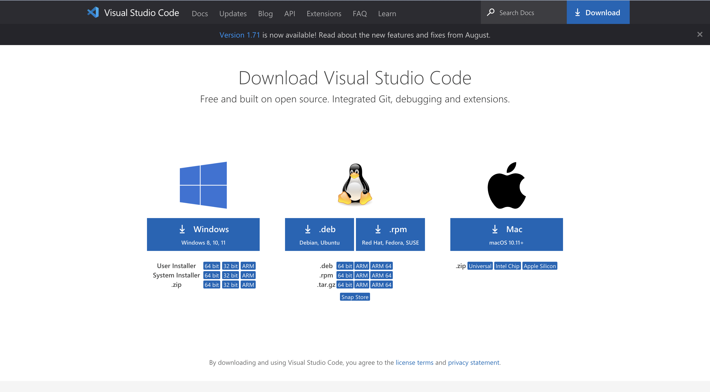
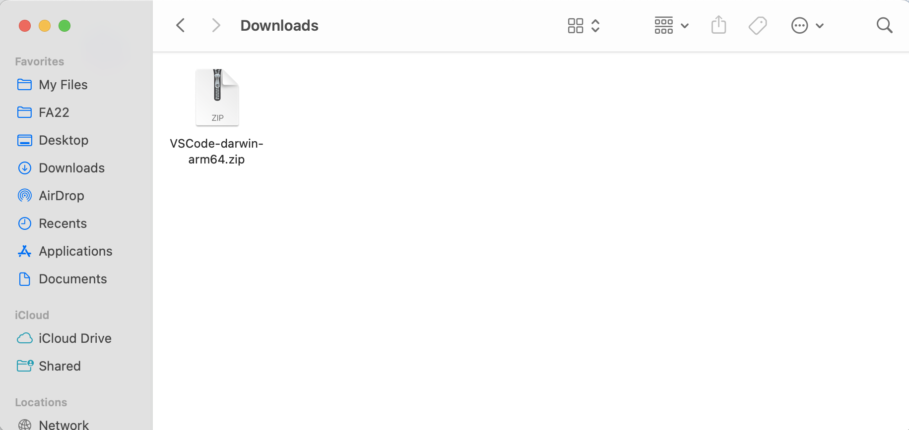
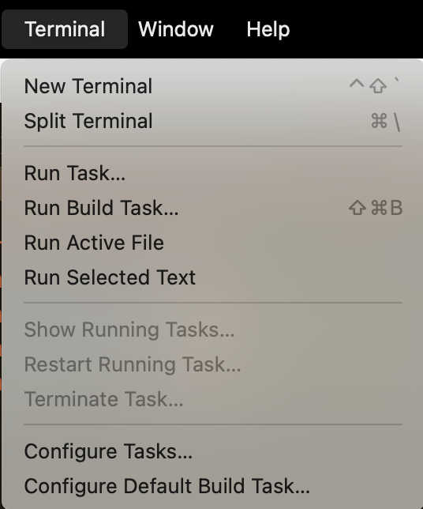
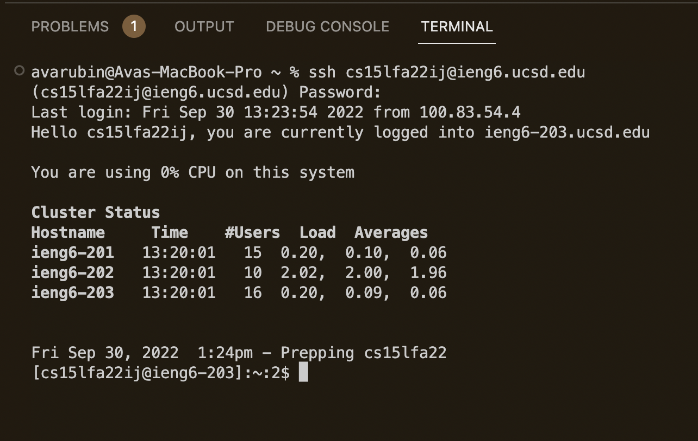
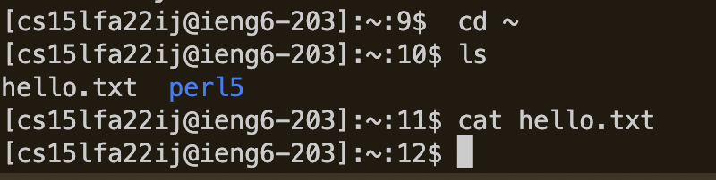
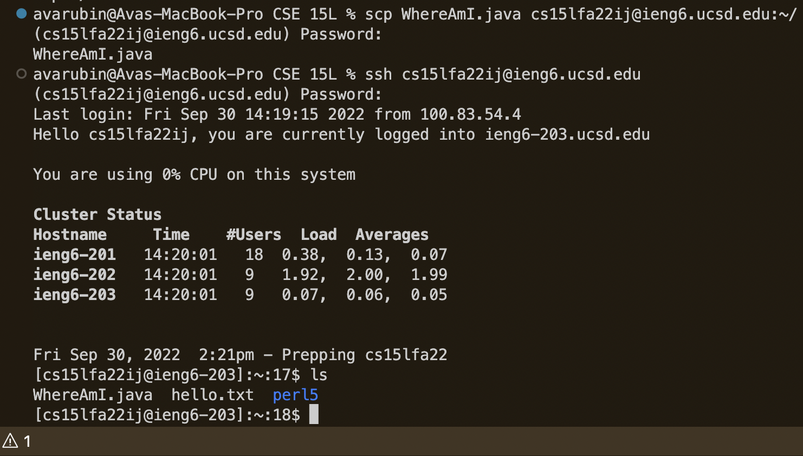
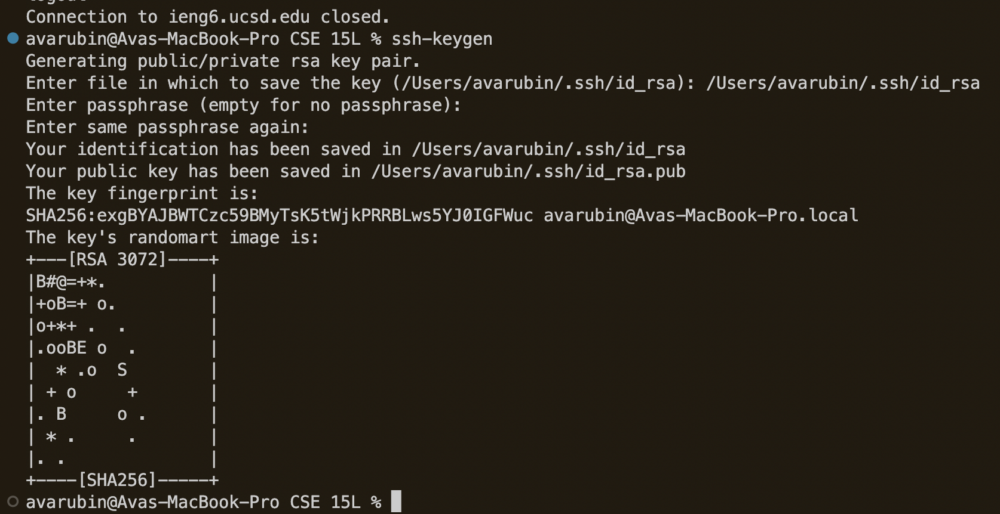
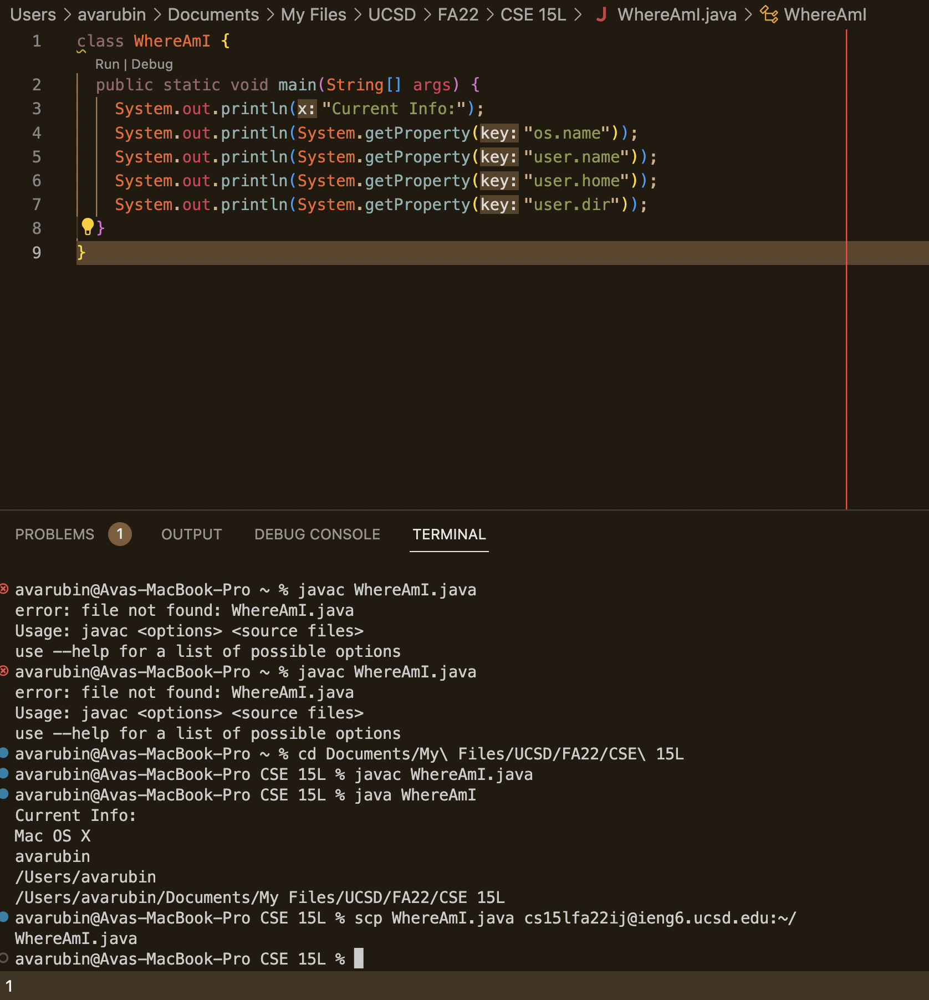

# Lab Report - *Week 1*
## Logging into your Course-Specific Account 
#### *September 30, 2022*
&nbsp;

## **I. Installing VS Code**
The first step you need to take is installing an IDE called VS Code. 
1. You can download VS Code [here.](https://code.visualstudio.com/download)

2. Once it's done downloading, find it in your downloads folder, and double click to open.

3. Follow the on screen directions to install on your computer!

&nbsp;

## **II. Remotely Connecting**
Now that we have VS Code installed, we can use it to remotely connect to the university's computers.
1. In the menu bar of VS Code there is an option called 'Terminal', click this, then open a new terminal

2. In the terminal, type `ssh cs15lfa22__@ieng6.ucsd.edu`
3. You should then be prompted to enter your ETS password *(Note: when typing, there is no feedback, it will look like you are not typing anything)*
4. Hit enter, and after a second, a message will appear confirming that you have successfully connected!

&nbsp;

## **III. Trying Some Commands**
Yay! We're in! Now to actually run some commands.
1. To explore the file system of the remote connection, there's a couple commands we can use.

+ `cd ~` to change the directory to the home directory
+ `ls` to list the files in the current directory
+ `cat <file>` to output the contents of a given file
+ `pwd` to print where in the directory you are


&nbsp;

## **IV. Moving files with `scp`**
Okay, so now you have some files on YOUR computer that you want to use on the remote one. How can we do this? With `scp`! This command lets us copy files from our local directory to the remote one. Here's how to do it!
1. Leave the ssh by typing the command `exit`
2. Either create or locate the file you want on the remote computer, and navigate to the directory it is in with `cd`
3. Enter the following command (but with your info) to move the file
```diff
scp FileName.java cs15lfa22xx@ieng6.ucsd.edu:~/
```
4. You should be prompted to enter your remote access password, do so, and hit enter
5. The file should now be copied, to make sure, log into the ssh and use the `ls` command



&nbsp;

## **V. Setting an SSH Key**
Typing in our password everytime we want to access to ssh gets annoying and tedious, luckily, there's way to avoid this!
1. If you haven't already, exit the remote connection so you are back to the client
2. In the terminal, enter `ssh-keygen`
3. In the following prompt, enter this `/Users/NAME/.ssh/id_rsa` *(Where NAME is your user profile)*
4. Hit enter when prompted to enter a passphrase
5. ssh back into the remote connection
6. Enter the following command: `mkdir .ssh` and then exit the ssh
7. Enter this command, but with your own info, into the terminal `scp /Users/NAME/.ssh/id_rsa.pub cs15lfa22xx@ieng6.ucsd.edu:~/.ssh/authorized_keys`
8. You should now be able to `ssh` and `scp` without entering your password!


&nbsp;

## **VI. Optimizing Remote Running**
Now that we can login without a password, working with the ssh is a lot quicker. 
1. When editing a file locally, it can quickly be copied to the remote computer with scp and shortcuts
2. After editing a given file in VS Code, I can compile and save it, and then use the command `scp FILENAME.java cs15lfa22xx@ieng6.ucsd.edu:~/` to copy it over
3. For subsequent edits, I can just use the up arrow in the terminal to call up my previous command.




&nbsp;
