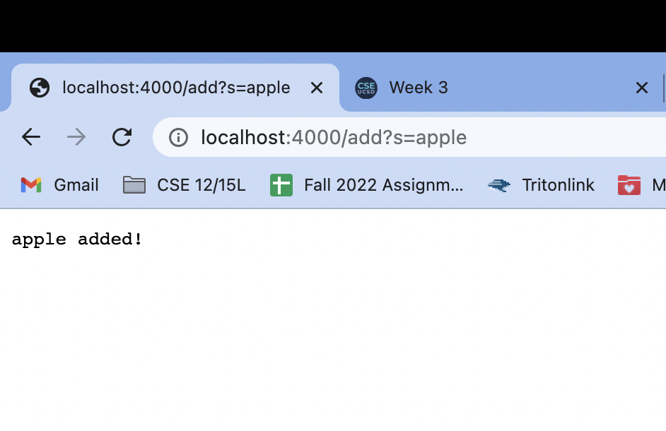
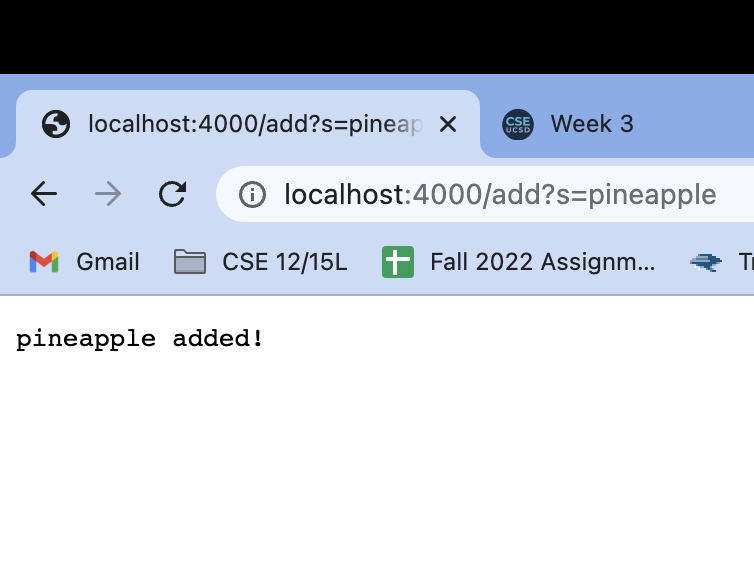
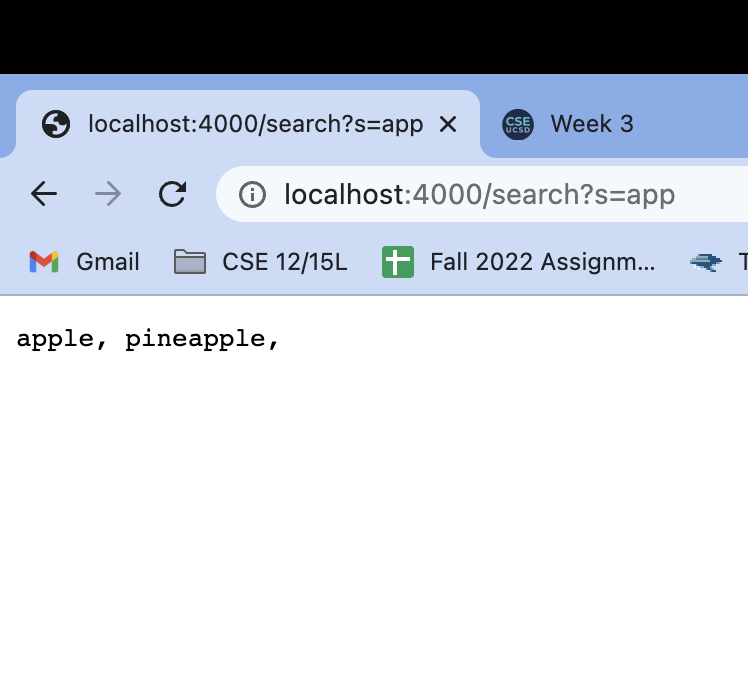

# Lab Report - *Week 3*
## Bugs!
#### *October 14, 2022*
&nbsp;

# Part One
## **I. Simplest Search Engine Code** ##
Here is the code I wrote to create a simple search engine
```diff
import java.io.IOException;
import java.net.URI;
import java.util.ArrayList;

class EngineHandler implements URLHandler {

    ArrayList<String> strings = new ArrayList<>();

    public String handleRequest(URI url) {
    
        if(url.getPath().contains("/add")){
            String[] parameters = url.getQuery().split("="); 
            if (parameters[0].equals("s")) { 
                strings.add(parameters[1]);
                return parameters[1] + " added!";
            }
        } 
    else if(url.getPath().contains("/search")){
        String[] parameters = url.getQuery().split("="); 
        if (parameters[0].equals("s")) { 
            String allFound = "";
            for(String string : strings){
                if(string.contains(parameters[1])){
                    allFound += string + ", ";
                }
            }
            return allFound;
        }

    }

    return "404 Not Found!";
    }

}

class SearchEngine {
    public static void main(String[] args) throws IOException {
        if(args.length == 0){ // checks to see if there a port number
            System.out.println("Missing port number! Try any number between 1024 to 49151"); 
            return;
        }

        int port = Integer.parseInt(args[0]); 

        Server.start(port, new EngineHandler()); 
    }
}
```

## **I. Simplest Search Engine in Action** ##
Here is the 'simplest search engine' in use!
### Example: Adding 'apple'

### Example: Adding 'pineapple'

### Example: Searching 'app'



# Part Two
## **I. Bug One** ##
## **II. Bug Two** ##