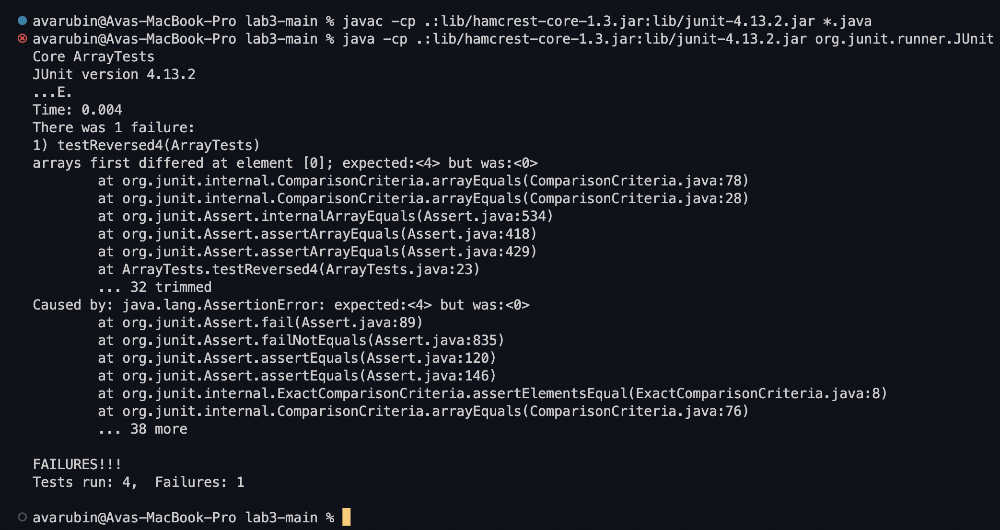
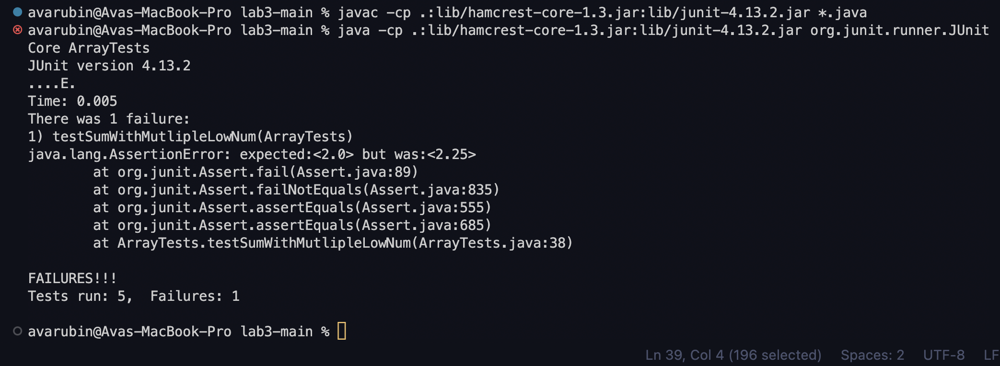

# Lab Report - *Week 3*
## Bugs!
#### *October 14, 2022*
&nbsp;

# Part One
## **I. Simplest Search Engine Code** 
Here is the code I wrote to create a simple search engine
```diff
import java.io.IOException;
import java.net.URI;
import java.util.ArrayList;

class EngineHandler implements URLHandler {

    ArrayList<String> strings = new ArrayList<>();

    public String handleRequest(URI url) {
    
        if(url.getPath().contains("/add")){
            String[] parameters = url.getQuery().split("="); 
            if (parameters[0].equals("s")) { 
                strings.add(parameters[1]);
                return parameters[1] + " added!";
            }
        } 
    else if(url.getPath().contains("/search")){
        String[] parameters = url.getQuery().split("="); 
        if (parameters[0].equals("s")) { 
            String allFound = "";
            for(String string : strings){
                if(string.contains(parameters[1])){
                    allFound += string + ", ";
                }
            }
            return allFound;
        }

    }

    return "404 Not Found!";
    }

}

class SearchEngine {
    public static void main(String[] args) throws IOException {
        if(args.length == 0){ // checks to see if there a port number
            System.out.println("Missing port number! Try any number between 1024 to 49151"); 
            return;
        }

        int port = Integer.parseInt(args[0]); 

        Server.start(port, new EngineHandler()); 
    }
}
```

## **I. Simplest Search Engine in Action** ##
Here is the 'simplest search engine' in use!
### Example: Adding 'apple'

#### Method Called:
#### Relevant Values:
#### How Values Change:

### Example: Adding 'pineapple'

#### Method Called:
#### Relevant Values:
#### How Values Change:

### Example: Searching 'app'

#### Method Called:
#### Relevant Values:
#### How Values Change:

# Part Two
## **I. Bug One: ArrayExamples 'reversed'** ##
The 'reversed' method of ArrayExamples.java was buggy. I wrote a test that inputs an array of length 4, and has the method reverse it. However, it was just returning an array of 0s. 

### Here is the test: 
 ```diff
@Test
  public void testReversed4(){
    int[] input1 = {1,2,3,4};
    int[] swapped = {4,3,2,1};
    assertArrayEquals(swapped, ArrayExamples.reversed(input1));
  }
 ```
### When running the test, this is the output:


In this method, the bug was that 'newArray' was used instead of 'arr' when swapping, and 'arr' was returned instead of 'newArray' when the method was done.

### Here is my fix:
```diff
  static int[] reversed(int[] arr) {
    
    int[] newArray = new int[arr.length];
    for(int i = 0; i < arr.length; i += 1) {
      newArray[i] = arr[arr.length - i - 1];
    }
    return newArray;
    

  }
```
### Symptom & Bug Connection
This bug causes the method to return an array of 0s because it was setting the contents of 'arr' to different indices of 'newArray', however, newArray was never given any values to store. So, when the method tried to set itself to values of 'newArray' it was just setting itself to 0.

## **II. Bug Two:** 
### Here is the test: 
```diff
@Test
  public void testSumWithMutlipleLowNum(){
    double[] input1 = {1,1,2,3,4};
    double testAvg = (1+2+3+4) / 4;
    assertEquals(testAvg, ArrayExamples.averageWithoutLowest(input1),0);
  }
```
### When running the test, this is the output:

In this method, the bug is that it removes ALL instances of the lowest number, rather than just one instance of it. Additionally, despite how many times the lowest number appears, when dividing the find the average, the method always divides by length-1.
### Here is my fix:

### Symptom & Bug Connection

