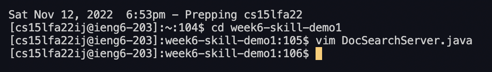

# Lab Report - *Week 7*
## Using vim
#### *November 14, 2022*
&nbsp;

## Replacing `start` with `base`

I was able to accomplish this task in 23 keys presses, and with only one command.

`:12,30s/start/base <Enter>`

`:wq<Enter>`

This is a search and replace command in Vim. 
However, I only wanted to replace `start` with `base` in the `getFiles` method. So, I set the range from line 12 to line 30, and had it replace any instance of `start` to `base`. 

After running the command, Vim outputs the message,  `3 substitutions on 3 lines`, letting me know that it found 3 instances of `start` on 3 seperate lines.      

Once I have replaced all instances of `start`, I type the command `:wq` which saves the file and then quits Vim.

After saving and exiting, I am taken back to the terminal, where I can continue running commands, or be done. 

## Comparing VS Code and Vim

Making the edits in VS Code took 88 seconds.

Making the edits in Vim took 57 seconds. 

Whether I use VS Code or Vim to edit a program that I want to run remotely would depend on the problem itself. If I had to constantly switch between files or was unsure about what I was doing, I would use VS Code. This is because in Vim, everytime I had to switch between files, I would have to exit Vim, then run the command to open whatever file I wanted to open. However, in VS Code, I can just click the tabs at the top of the window to switch between files. Additionally, VS Code provides feedback as I write, so if syntax is incorrect, or there is a blatant error, VS Code will alert me, and even suggest fixes. Vim doesn't do this, so if I was editing or writing a complicated or long file, I would opt for VS Code. I would use Vim to make quick edits in a file that I wanted to upload and run remotely. 

