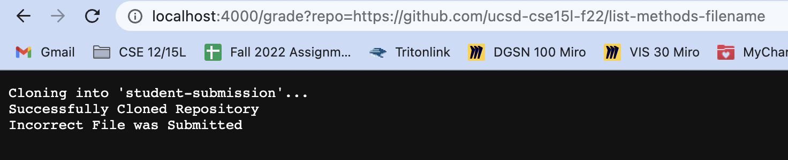
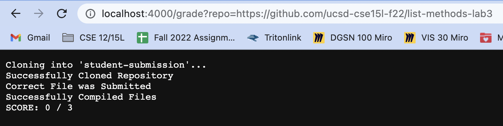

# Lab Report - *Week 9*
## Autograder
#### *November 25, 2022*
&nbsp;

## My `grade.sh` Script

```diff
rm -rf student-submission 
git clone $1 student-submission 
echo "Successfully Cloned Repository" 

cp TestListExamples.java student-submission/ 
cp -r lib student-submission/ 
cd student-submission 

if [[ -e ListExamples.java ]] 
then
    echo "Correct File was Submitted"
else
    echo "Incorrect File was Submitted"
    exit 
fi 

javac -cp .:lib/hamcrest-core-1.3.jar:lib/junit-4.13.2.jar *.java 2> errors.txt

if [[ $? -eq 0 ]]
then
    echo "Successfully Compiled Files"
else
    echo "Failed to Compile Submitted Files"
    exit
fi

java -cp .:lib/hamcrest-core-1.3.jar:lib/junit-4.13.2.jar org.junit.runner.JUnitCore TestListExamples | grep "Tests run:" > runTests.txt

if ! grep -q '[^[:space:]]' runTests.txt; 
then
    echo "PASSED ALL TESTS"
else
    TESTSCORE=(`grep -o '[0-9]' runTests.txt`)
    CORRECT=$((${TESTSCORE[0]} - ${TESTSCORE[1]})) 
    echo "SCORE: $CORRECT / ${TESTSCORE[0]}"
fi
```

## My `grade.sh` Examples

### Example 1 in Server: Compiler Error


### Example 2 in Server: Wrong Files Submitted


### Example 3 in Server: Running Tests


## Tracing `grade.sh`: Compiler Error
### The following is the process of what happens in `grade.sh` when passed in a repo that has a syntax error and therefore does not compile
```diff
rm -rf student-submission 
git clone $1 student-submission 
echo "Successfully Cloned Repository" 

cp TestListExamples.java student-submission/ 
cp -r lib student-submission/ 
cd student-submission 
```
All of the above lines run with error, and no output. The return code is 0 because they all succeed.

```diff
if [[ -e ListExamples.java ]]
```
This condition of this `if-statement` is true. 
```diff
then
    echo "Correct File was Submitted"
```
The above lines run, with a return code of 0. No errors. The output is "Correct File was Submitted"
```diff
else
    echo "Incorrect File was Submitted"
    exit 
fi 
```
Aside from the `fi` (because this just marks the end of the `if` statement) none of these lines run because the condition was true. 

```diff
javac -cp .:lib/hamcrest-core-1.3.jar:lib/junit-4.13.2.jar *.java 2> errors.txt
```
This line is where the issue occurs. It attempts to compile the files, but since there is a syntax error, it cannot do so. `stderr` is 
```diff
ListExamples.java:15: error: ';' expected
        result.add(0, s)
                        ^
1 error
```
and there is no output. The return code is `1` because it failed to compile.

```diff
if [[ $? -eq 0 ]]
```
This conditional evaluates to false because the return code was 1, not 0.

```diff
then
    echo "Successfully Compiled Files"
```
Because it evaluates to false, these lines never run.

```diff
else
    echo "Failed to Compile Submitted Files"
    exit
fi
```
These lines all run, with no error. The output is "Failed to Compile Submitted Files" and then the script exits.


